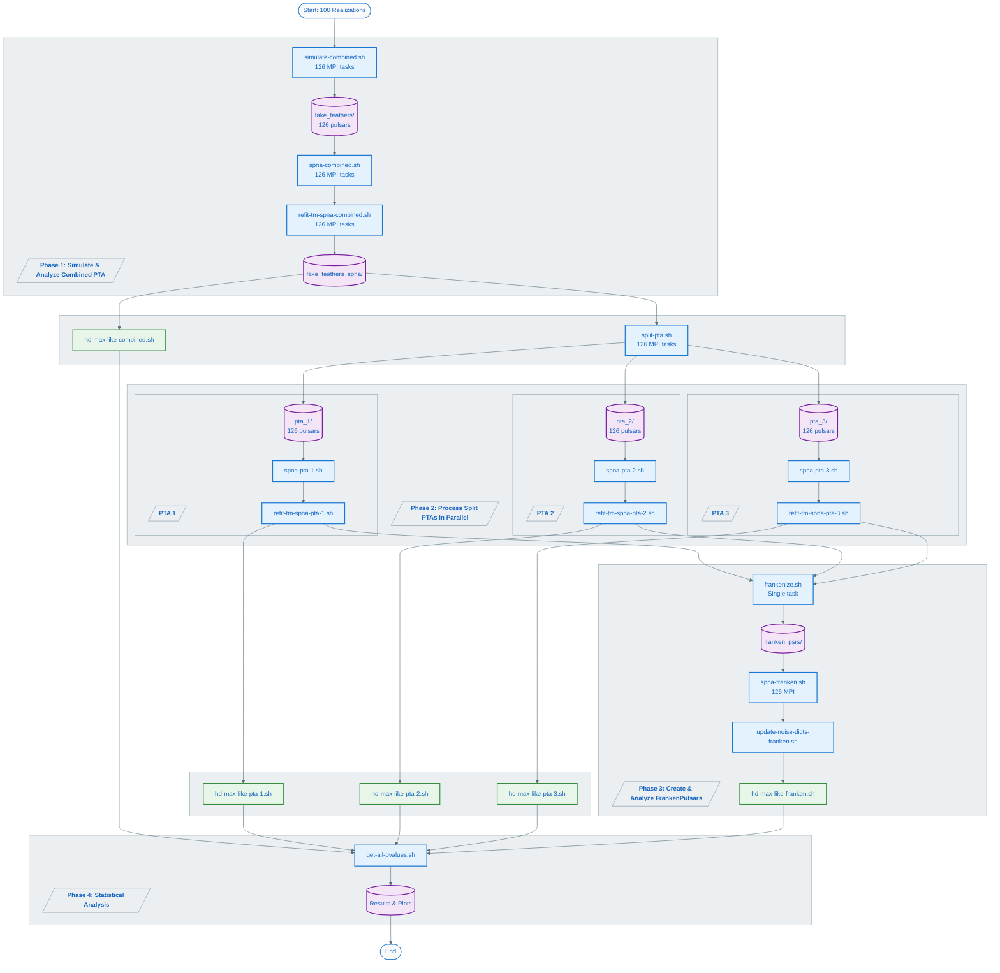

# FrankenStat I: a New Approach to Pulsar Timing Array Data Combination

 

Flowchart detailing pipeline

  

```mermaid
%%{init: {'theme': 'base', 'themeVariables': { 'primaryColor': '#e3f2fd', 'primaryTextColor': '#1565c0', 'primaryBorderColor': '#1976d2', 'lineColor': '#546e7a', 'secondaryColor': '#f5f5f5', 'tertiaryColor': '#fafafa', 'background': '#ffffff', 'mainBkg': '#fafafa', 'secondBkg': '#f5f5f5', 'clusterBkg': '#eceff1', 'clusterBorder': '#90a4ae'}}}%%
flowchart TD
    %% Styling
    classDef cpuJob fill:#e3f2fd,stroke:#1976d2,stroke-width:2px
    classDef dataNode fill:#f3e5f5,stroke:#7b1fa2,stroke-width:2px
    classDef hdJob fill:#e8f5e9,stroke:#388e3c,stroke-width:2px
    classDef titleNode fill:#eceff1,stroke:#78909c,stroke-width:1px,font-weight:bold

    Start([Start: 100 Realizations])

    subgraph Phase1[" "]
        direction TB
        P1Title[/"Phase 1: Simulate & Analyze Combined PTA"/]
        SimCombined[simulate-combined.sh<br/>126 MPI tasks]
        FakeFeathers[(fake_feathers/<br/>126 pulsars)]
        SPNACombined[spna-combined.sh<br/>126 MPI tasks]
        RefitCombined[refit-tm-spna-combined.sh<br/>126 MPI tasks]
        FakeFeathersRefit[(fake_feathers_spna/)]
    end

    subgraph Branch[" "]
        direction LR
        HDCombined[hd-max-like-combined.sh]
        SplitPTA[split-pta.sh<br/>126 MPI tasks]
    end

    subgraph Phase2[" "]
        direction TB
        P2Title[/"Phase 2: Process Split PTAs in Parallel"/]

        subgraph PTA1Branch[" "]
            direction TB
            PTA1Label[/PTA 1/]
            PTA1[(pta_1/<br/>126 pulsars)]
            SPNA1[spna-pta-1.sh]
            Refit1[refit-tm-spna-pta-1.sh]
        end

        subgraph PTA2Branch[" "]
            direction TB
            PTA2Label[/PTA 2/]
            PTA2[(pta_2/<br/>126 pulsars)]
            SPNA2[spna-pta-2.sh]
            Refit2[refit-tm-spna-pta-2.sh]
        end

        subgraph PTA3Branch[" "]
            direction TB
            PTA3Label[/PTA 3/]
            PTA3[(pta_3/<br/>126 pulsars)]
            SPNA3[spna-pta-3.sh]
            Refit3[refit-tm-spna-pta-3.sh]
        end
    end

    subgraph HDSplit[" "]
        direction LR
        HD1[hd-max-like-pta-1.sh]
        HD2[hd-max-like-pta-2.sh]
        HD3[hd-max-like-pta-3.sh]
    end

    subgraph Phase3[" "]
        direction TB
        P3Title[/"Phase 3: Create & Analyze FrankenPulsars"/]
        Franken[frankenize.sh<br/>Single task]
        FrankenPsrs[(franken_psrs/)]
        SPNAFranken[spna-franken.sh<br/>126 MPI]
        UpdateNoise[update-noise-dicts-franken.sh]
        HDFranken[hd-max-like-franken.sh]
    end

    subgraph Phase4[" "]
        direction TB
        P4Title[/"Phase 4: Statistical Analysis"/]
        PValues[get-all-pvalues.sh]
        Results[(Results & Plots)]
    end

    %% Main flow
    Start --> SimCombined
    SimCombined --> FakeFeathers
    FakeFeathers --> SPNACombined
    SPNACombined --> RefitCombined
    RefitCombined --> FakeFeathersRefit
    FakeFeathersRefit --> HDCombined
    FakeFeathersRefit --> SplitPTA

    %% Split to 3 PTAs
    SplitPTA --> PTA1 --> SPNA1 --> Refit1
    SplitPTA --> PTA2 --> SPNA2 --> Refit2
    SplitPTA --> PTA3 --> SPNA3 --> Refit3

    %% Refit to HD and Franken
    Refit1 --> HD1
    Refit2 --> HD2
    Refit3 --> HD3
    Refit1 --> Franken
    Refit2 --> Franken
    Refit3 --> Franken

    %% Franken processing
    Franken --> FrankenPsrs --> SPNAFranken --> UpdateNoise --> HDFranken

    %% All HD to p-values
    HDCombined --> PValues
    HD1 --> PValues
    HD2 --> PValues
    HD3 --> PValues
    HDFranken --> PValues
    PValues --> Results --> End([End])

    %% Apply styles
    class SimCombined,SPNACombined,RefitCombined,SplitPTA,SPNA1,SPNA2,SPNA3,Refit1,Refit2,Refit3,Franken,SPNAFranken,UpdateNoise,PValues cpuJob
    class HDCombined,HD1,HD2,HD3,HDFranken hdJob
    class FakeFeathers,FakeFeathersRefit,PTA1,PTA2,PTA3,FrankenPsrs,Results dataNode
    class P1Title,P2Title,P3Title,P4Title,PTA1Label,PTA2Label,PTA3Label titleNode

```

